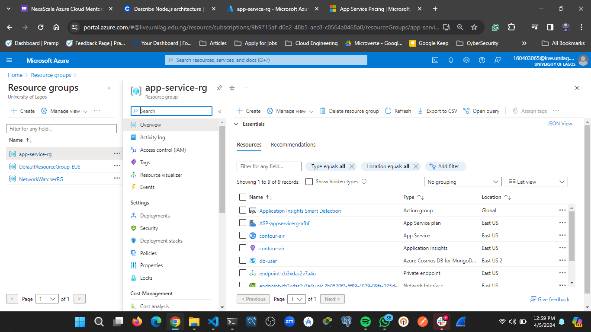
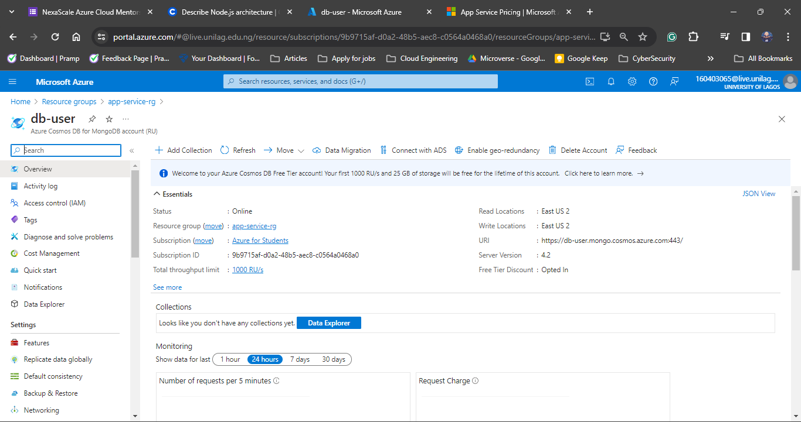
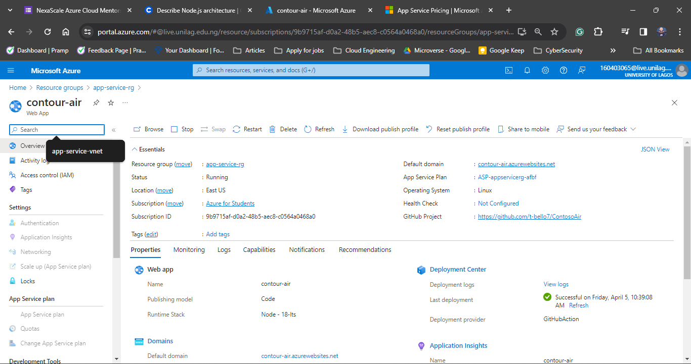
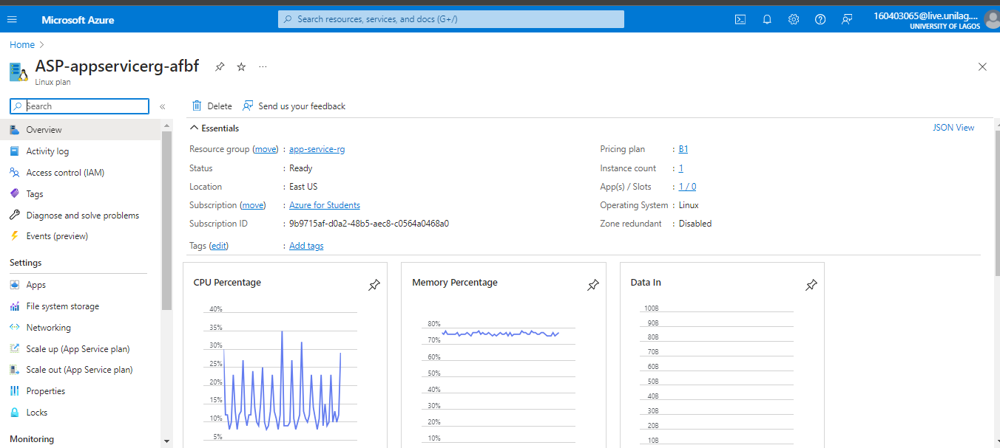
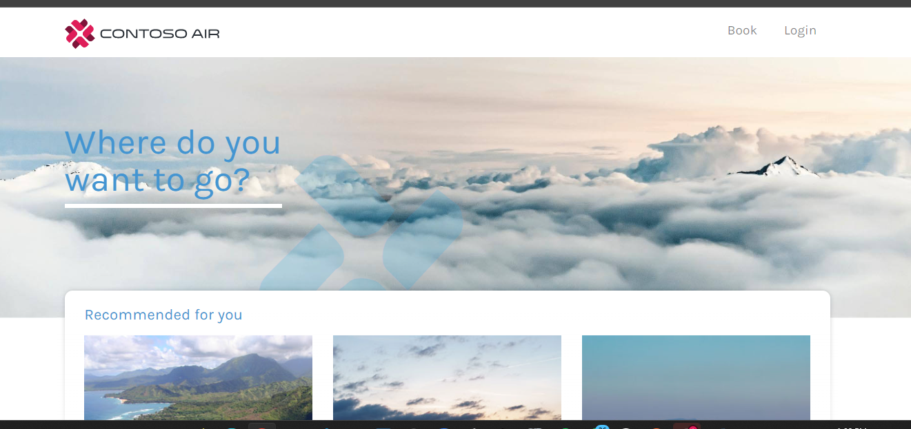
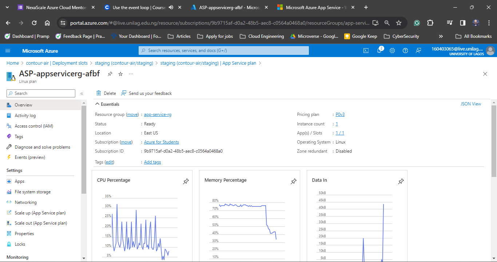
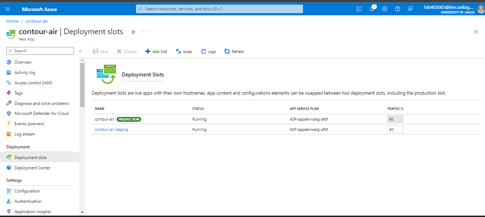

# Deploy Node JS Application with Mongo DB

Azure App Service is a platform as a service that provides a platfrom to easily deploy applications of different stack.
In this task I deployed a Node JS application to Azure App Service and created a Cosmo DB Server for the database credentials. Below are the steps I took
- Create a Resource Group in US East to add resources 

- Create An Azure Cosmos DB and note the credentaials for authenticaiton which are the Cosmos Account Name, Cosmos Primary password and Connection URL

-  Create a Web APP in the resource group and skip the Database Fields. 

- Created a virtaul Network and Subnet in the Resource Group during the creation of the Web App Service

- Enabled Continous Deployment and Linked my github account to App service 

- I choose the Basic Service Plan (B1)

- The deployed link is https://contour-air.azurewebsites.net/

- Upgraded App Service plan to Premium V3 P0V3 to enable staging slot feature

- Added the Staging Slot

- The deployed staging slot link is https://contour-air-staging.azurewebsites.net/